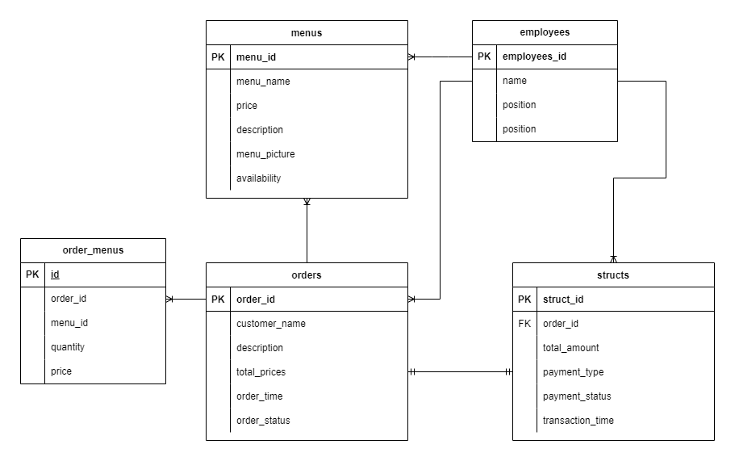

# LoyaltoQoinTechnicalTest
- Soal Teori
1. Rancangkanlah diagram database untuk aplikasi rumah makan.
Jelaskan teknologi yang akan dipakai untuk aplikasi ini dan mengapa anda memilih teknologi
tersebut.
Kebutuhan:
1. Aplikasi ini bisa memasukkan pesanan-pesanan makanan pelanggan
2. Aplikasi ini bisa mengeluarkan struk pembelian
3. Aplikasi ini bisa mengeluarkan laporan penghasilan mingguan dan bulanan
4. Aplikasi ini bisa mengeluarkan laporan stok
Selain kebutuhan pokok diatas, silahkan tambahkan ide original anda untuk membuat aplikasi
lebih baik.
(catatan: Soal ini tidak membutuhkan pengambil test untuk membuat aplikasi (coding). )

Berikut adalah Diagram aplikasi rumah makan sederhana:

<h3>Penjelasan</h3>

<h4>Dalam diagram tersebut terdapat 5 table:</h4>
1. employees merupakan table yang berisikan admin,kasir nantinya
2. menus merupkan table untuk menyimpan data semua menu makanan di restaurant
3. structs merupakan table yang digunakan untuk mencetak struk pembayaran
4. orders merupakan table yang digunakan oleh kasir untuk mencatat pesanan customers 
5. order_menus merupakan table yang berelasi dengan orders dan menus sehingga semua menu yang dipesan customers akan tercatat disini

<h4>Technology yang akan dipakai adalah:</h4>
1. Go merupakan salah satu bahasa pemograman yang kinerja nya sangat cepat dan mudah dipelajari sehingga cocok untuk dijadikan sebagai bahasa pemograman untuk Backend 
2. ReactJs merupakan salah satu framework front end yang responsifnya cepat dan interaktif. reactjs juga merupakan framework yang populer saat ini 
3. Mysql dipilih sebagai sistem manajemen basis data karena mudah digunakan dan dapat menangani skala besar data. MySQL juga memungkinkan penggunaan indeks pada tabel-tabel database, sehingga mempercepat pengambilan data pada saat aplikasi membutuhkan laporan penghasilan mingguan dan bulanan serta laporan stok. 
4. GORM merupakan salah satu library ORM dari bahaasa pemograman Go, gorm memudahkan nantinya untuk berinteraksi dengan data 
5. Echo merupakan salah satu framework dari bahasa pemograman Go , dipilih karena sangat ringan dan performanya cepat, sangat bagus jika digunakan untuk membuat API 
